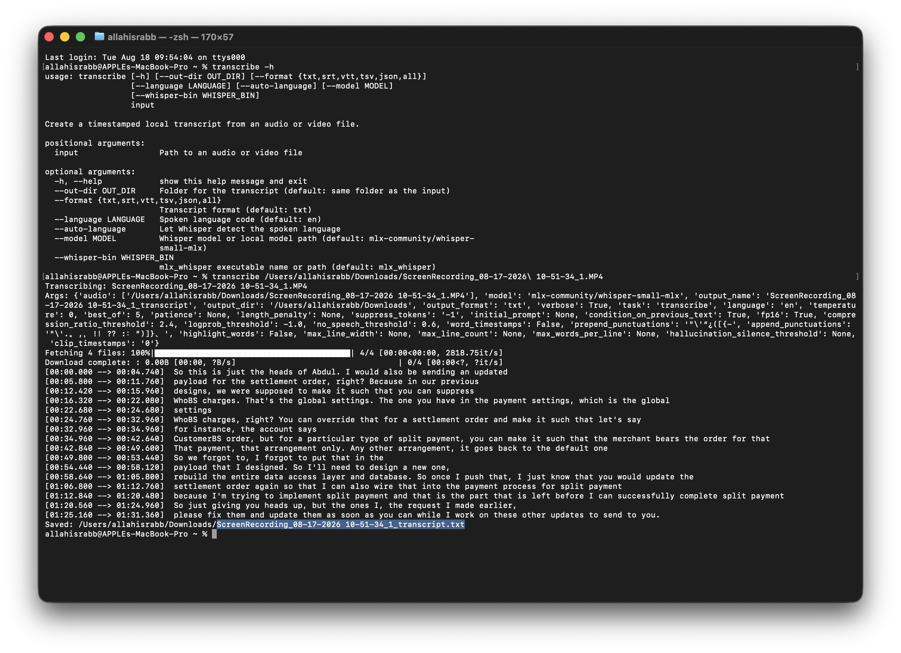
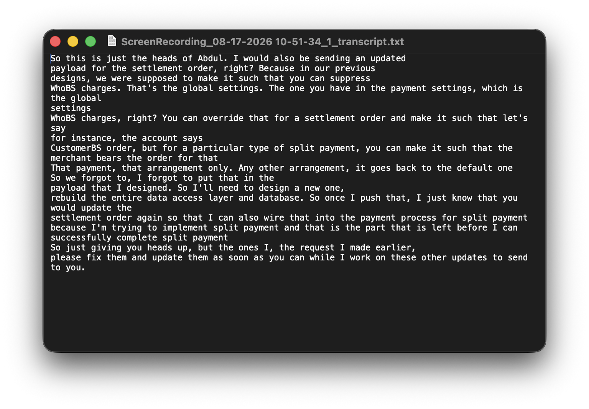
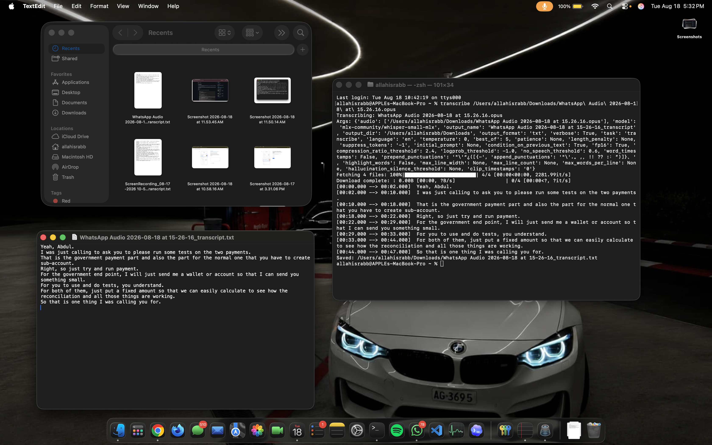

# Transcribe

Transcribe audio and video locally on an Apple Silicon Mac with
[MLX Whisper](https://github.com/ml-explore/mlx-examples/tree/main/whisper).
The default result is a readable TXT transcript saved beside the source.
Timestamped subtitle output is available as SRT or VTT.

The tool is useful for voice notes, meetings, interviews, and screen
recordings. It supports OPUS, OGG, M4A, MP3, WAV, MP4, and MOV input through
FFmpeg. Other FFmpeg-compatible formats may also work but are not part of the
tested interface.

## One-command setup

Paste this single command into Terminal:

```bash
/bin/bash -c "$(curl -fsSL https://raw.githubusercontent.com/Abdussalam-Mujeeb-ur-rahman/transcribe/main/install.sh)" && exec zsh -l
```

The installer automatically:

1. Confirms macOS 14 or newer and an Apple silicon `arm64` environment.
2. Checks for Homebrew, native Python 3.10+, FFmpeg, and `pipx`.
3. Installs Homebrew only when it is needed, then installs only missing tools.
4. Installs MLX Whisper with `pipx` when it is not already available.
5. Installs `transcribe` under your user account and configures your shell path.
6. Verifies the installed versions and runs `transcribe --help`.
7. Reloads your shell so the command is ready immediately.

Homebrew may request your macOS password or confirmation if it must be
installed. Dependency setup can take several minutes. You can
[review the installer](install.sh) before running it.

When setup finishes, start with:

```bash
transcribe --help
```

## Demo

Run `transcribe --help`, then transcribe a file directly from Terminal:



Open the generated TXT file to read the transcript:



Drag a voice note from Finder into Terminal, transcribe it, and open the saved
TXT result:



## Privacy

Transcription runs on your Mac. Recordings are not sent to a hosted
transcription API by this project. The selected model is downloaded from
Hugging Face on first use and cached locally, so the first run can take longer
and requires internet access. Later transcription can run from the local model
cache.

## Requirements

- macOS 14 or newer on an Apple Silicon Mac (M1 or newer)
- An internet connection for setup and the first model download
- Enough free space for dependencies and roughly 500 MB for the default model

The installer handles Python, [Homebrew](https://brew.sh/), FFmpeg, `pipx`, and
MLX Whisper. Intel Macs are not supported. If Terminal is running through
Rosetta, the installer stops and explains how to continue natively.

## Start transcribing

```bash
transcribe "/path/to/recording.mp4"
```

English and plain TXT are the defaults. The result is saved beside the
recording:

```text
recording.mp4
recording_transcript.txt
```

Dots inside the original basename are changed to hyphens in the output name.
For example, `voice.note.09.38.opus` produces
`voice-note-09-38_transcript.txt`. The source file is never renamed.

## Drag a file from Finder

Type `transcribe`, add one space, drag the file from Finder into Terminal, and
press Return:

```text
transcribe /Users/you/Downloads/WhatsApp\ Audio\ 2026-08-18.opus
```

Terminal inserts backslashes to escape spaces. Do **not** put quotation marks
around a path that already contains those automatically inserted backslashes:

```text
Correct:   transcribe /Users/you/Downloads/WhatsApp\ Audio\ 2026-08-18.opus
Incorrect: transcribe "/Users/you/Downloads/WhatsApp\ Audio\ 2026-08-18.opus"
```

For a path typed manually, use quotation marks and no backslashes:

```bash
transcribe "/Users/you/Downloads/WhatsApp Audio 2026-08-18.opus"
```

Quoted paths and escaped paths are two different shell styles for protecting
spaces. Use either style, not both at once.

## Choose the output directory

By default, the transcript is written beside the input file. `--out-dir`
creates and uses another directory:

```bash
transcribe "/path/to/recording.mov" \
  --out-dir "$HOME/Documents/Transcripts"
```

## Output formats

```bash
transcribe "/path/to/recording.mp4" --format txt
transcribe "/path/to/recording.mp4" --format srt
transcribe "/path/to/recording.mp4" --format vtt
transcribe "/path/to/recording.mp4" --format tsv
transcribe "/path/to/recording.mp4" --format json
transcribe "/path/to/recording.mp4" --format all
```

| Format | Typical use |
| --- | --- |
| TXT | Readable plain transcript; the default |
| SRT | Subtitles for video players and editors |
| VTT | Web subtitles and captions |
| TSV | Timing data in tab-separated rows |
| JSON | Structured segments and metadata |
| ALL | Generate all formats in one run |

## Language selection

English is the default. Set a Whisper language code when the recording uses
another language:

```bash
transcribe "/path/to/recording.m4a" --language fr
transcribe "/path/to/recording.m4a" --language yo
```

Let Whisper detect the spoken language by omitting the explicit language from
the underlying command:

```bash
transcribe "/path/to/recording.mov" --auto-language
```

If both options are supplied, `--auto-language` takes precedence.

## Model selection

The default model is `mlx-community/whisper-small-mlx`, a practical speed and
accuracy balance on Apple Silicon. Choose a different Hugging Face model or a
local model path with `--model`:

```bash
transcribe "/path/to/recording.mp4" \
  --model mlx-community/whisper-large-v3-turbo
```

Larger models generally need more memory and time. Each new remote model is
downloaded on its first use. Set a reusable default with:

```bash
export MLX_WHISPER_MODEL="mlx-community/whisper-small-mlx"
```

## Command-line options

```text
usage: transcribe [-h] [--out-dir OUT_DIR]
                  [--format {txt,srt,vtt,tsv,json,all}]
                  [--language LANGUAGE] [--auto-language]
                  [--model MODEL] [--whisper-bin WHISPER_BIN] [--verbose]
                  input

positional arguments:
  input                 Path to an audio or video file

options:
  -h, --help            Show help and exit
  --out-dir OUT_DIR     Folder for the transcript; defaults to input folder
  --format FORMAT       txt, srt, vtt, tsv, json, or all; defaults to txt
  --language LANGUAGE   Spoken language code; defaults to en
  --auto-language       Let Whisper detect the spoken language
  --model MODEL         Hugging Face model name or local model path
  --whisper-bin PATH    mlx_whisper executable name or explicit path
  --verbose             Show detailed MLX Whisper arguments and segments
```

Normal runs show transcription progress without dumping MLX Whisper's internal
argument dictionary or every segment to Terminal. Add `--verbose` when that
detailed diagnostic output is useful.

`MLX_WHISPER_BIN` can set a default executable name or path. A command-line
option overrides the environment variable. The tool searches `PATH` first and
also recognizes the standard `~/Library/Python/*/bin` location used by older
`pip install --user` setups on macOS.

## Troubleshooting

### `command not found: transcribe`

Open a new Terminal window first. If the command is still unavailable, rerun
the one-command setup; it safely skips tools that are already installed:

```bash
/bin/bash -c "$(curl -fsSL https://raw.githubusercontent.com/Abdussalam-Mujeeb-ur-rahman/transcribe/main/install.sh)" && exec zsh -l
```

### `mlx_whisper was not found`

Rerun the one-command setup. It checks `pipx` and MLX Whisper independently,
then repairs only the missing part:

```bash
/bin/bash -c "$(curl -fsSL https://raw.githubusercontent.com/Abdussalam-Mujeeb-ur-rahman/transcribe/main/install.sh)" && exec zsh -l
```

### The media file cannot be decoded

Install or update FFmpeg and verify the source plays normally:

```bash
brew install ffmpeg
ffprobe "/path/to/recording.mp4"
```

### The first run is slow

The default model is probably downloading. Allow roughly 500 MB of free space;
download time depends on your connection. Later runs reuse the cache, although
larger models still take longer to download and transcribe.

### The transcript is inaccurate

Specify the language, try a larger model, and use the clearest recording
available. Names, specialist terms, accents, noise, low volume, music, and
overlapping speakers can reduce accuracy.

Whisper output is probabilistic and can omit, mishear, or invent words. Review
important transcripts against the original recording. This tool does not
identify speakers and should not be treated as a certified or legal
transcription service.

## Development and validation

The automated tests use Python's standard library and do not run a model:

```bash
python3 -m unittest discover -s tests -v
python3 -m py_compile transcribe_media.py tests/*.py
```

Recordings, generated transcripts, caches, secrets, and local environments are
excluded by `.gitignore`.

## Future direction

An npm wrapper may eventually make command discovery familiar to JavaScript
users, but it would still depend on Python, MLX Whisper, and FFmpeg. The first
release intentionally stays Python-only.

## License

[MIT](LICENSE)
