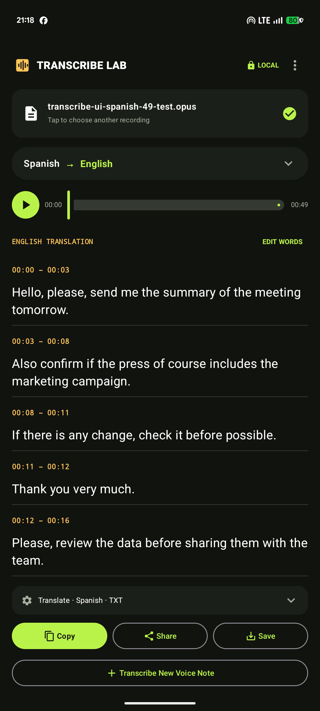

# Transcribe Lab for Android — prototype

This is an early native Android prototype, separate from the Apple Silicon
Mac app. Its intended path is **WhatsApp → Share → Transcribe Lab → text**,
without a terminal, account, or audio upload. The app also has a file picker.
It can transcribe speech in its original language (English to English, Spanish
to Spanish, and other supported languages) or translate speech into English.
Processing runs on the phone with `whisper.cpp`.



*Pixel 7 prototype with a synthetic 49-second Spanish voice note. This shows the
result screen, not a guarantee of word-for-word accuracy on every recording.*

## Download status

There is **no public Android download yet**. The app has been built and tested
locally on a Pixel 7, but its APK has not been published as a signed release.
The Mac installer and GitHub source-code ZIP are not Android installers.

For a public beta, the intended download location is this repository's
[GitHub Releases](https://github.com/Abdussalam-Mujeeb-ur-rahman/transcribe/releases)
page. Once a signed Android APK is published there, users will be able to
download that APK on their phone and install it. Until then, the build steps
below are for developers testing from source, not an end-user download path.

## Current scope

- Android 10+ on ARM64, with a Pixel 7 as the first intended test device.
- Shared audio and the system picker; automatic detection or an explicit spoken
  language, including English, Spanish, Turkish, Chinese, Korean, Portuguese,
  French, German, Arabic, and Hindi.
- Transcription in the spoken language or translation into English. The selected
  task is visible before processing, rather than silently translating English.
- TXT, SRT, VTT, TSV, or JSON output with copy, Android text share, and save.
  Timed segments can be edited before export.
- A result-first phone layout: completed transcript segments appear immediately
  below the recording and language direction, with Copy, Share, Save, and
  **Transcribe New Voice Note** kept at the bottom. Settings expand only when
  needed, and the selected recording has an on-device playback control.
- The multilingual Base model (about 142 MiB) or optional multilingual Small
  model (about 466 MiB). Each is downloaded once and integrity-checked. Small
  may improve difficult wording, but requires more space and runs slower; it
  does not guarantee the correct words.
- Animated processing feedback while the native engine has not yet reported a
  percentage; elapsed time and true percentage when one becomes available.
- Up to 10 minutes or 100 MB per recording in this prototype.
- Keep the app open during processing. Background processing, notification
  controls, and multi-file jobs are not built yet.

On a Pixel 7 running Android 17, synthetic Opus samples were tested in all
three core paths: English speech to English text, Spanish speech to Spanish
text, and Spanish speech to English text. The Spanish runs also rendered SRT
subtitles with timestamps. An Android-granted `ACTION_SEND` URI worked in an
earlier check. A 35-second synthetic clip showed a real, nonzero progress
percentage while processing. The optimized debug build completed short samples
in seconds to tens of seconds. A Spanish Opus voice note selected through the
phone's file picker also produced Spanish transcription and English translation.
These checks do **not** yet validate sharing directly from WhatsApp with this
version, the optional Small model, subtitle save/share on-device, or sustained
performance and battery use on long recordings.

Speech recognition can mishear a phrase that is acoustically ambiguous. The
app does not silently rewrite guessed words into a different meaning. For
better results, choose the spoken language explicitly, try Small if available,
add names or unusual terms as optional hints, then review/edit important words
before sharing or saving. Subtitle timestamps remain attached to each edited
segment.

## Build

Install JDK 17 and the Android SDK with platform 36, build tools 36.0.0,
NDK 27.0.12077973, and CMake 3.22.1. Set `ANDROID_HOME` to your SDK path.
From this directory run:

```bash
./gradlew :app:assembleDebug
```

The build downloads the pinned `whisper.cpp` source. The debug APK is written
to `app/build/outputs/apk/debug/app-debug.apk`. Install on a connected Pixel
with `adb install -r app/build/outputs/apk/debug/app-debug.apk`.

The first launch needs internet to download the model. The app does not request
broad file access; shared recordings are copied into app-private temporary
storage for decoding and then removed. The model remains in private app storage.

## Future beta updates

Maintainers should increase `versionCode` for each new APK, build a release APK,
and sign it with the **same release key** used for this beta. Publish the new
APK on GitHub Releases. With the same app ID and signing key, Android can
install a newer version over an existing release without downloading the model
again. The release key and its password are stored outside this repository;
keep a secure backup of both and never commit them. The earlier Pixel debug
build uses a different key and cannot be updated in place to the first beta.

## First physical-device check

1. Open the app, download Base, and confirm that it says the model is ready.
2. In WhatsApp, share a short Spanish voice note to Transcribe Lab.
3. Confirm the correct voice note name appears. Choose **Transcribe** and
   **Spanish**, and confirm the result stays in Spanish. Then choose
   **Translate to English** and confirm the English result.
4. Repeat with an English voice note in **Transcribe** mode. Review the wording,
   edit a segment, and check TXT and SRT saving. Watch the animated processing
   feedback, cancellation, and whether the app stays responsive.
5. Only if you want the extra download, try Small on a difficult recording and
   compare results. Also observe run time, heat, and battery on longer notes.

Until a real WhatsApp-share check passes, this should be treated as a developer
prototype, not as a supported Android release.
